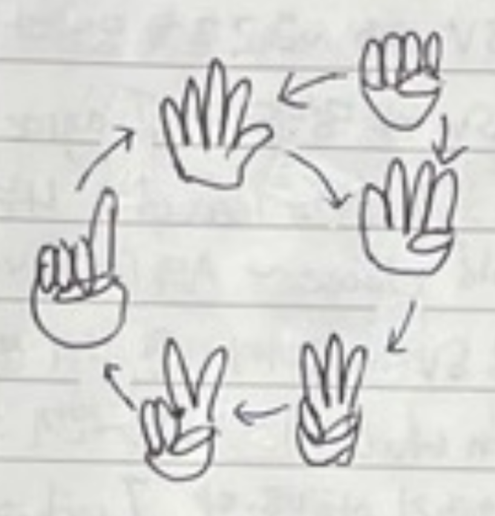
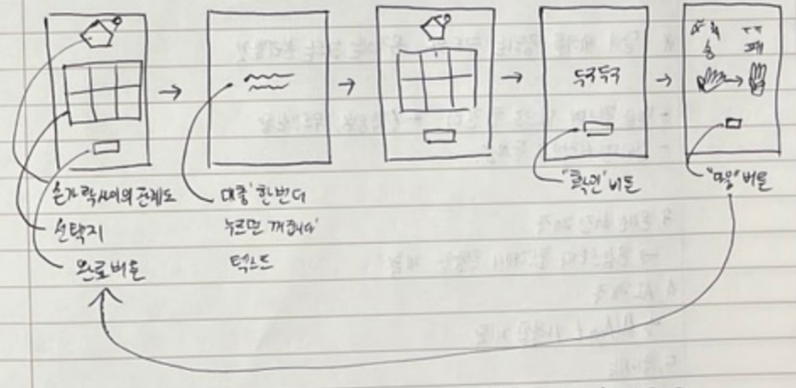
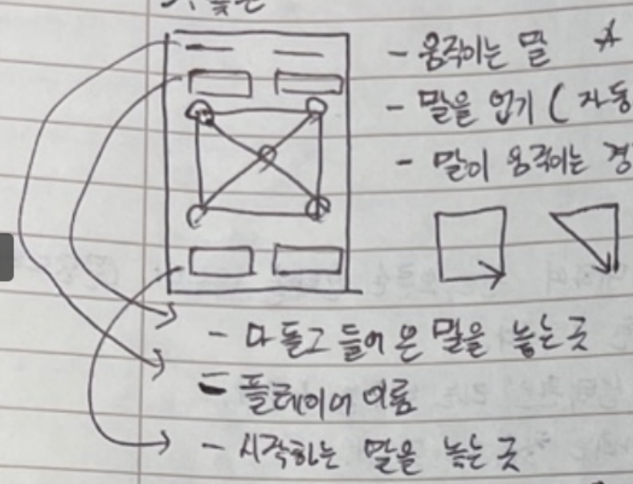

# 손가락 윷놀이 

기획자: 류지민  
프로그래머: 오민혁, 정진, 박준영, 윤정필  
그래픽: 윤석민  

## 개요

0~5개의 펼친 손가락으로 윷셈을 대신한 윷놀이. 윷이 없어도, 시끄러우면 안 되는 환경에서도 윷놀이를 즐길 수 있다. 가위바위보처럼 펼친 손가락의 수들은 서로 이기고 지는 관계를 갖는다. 상황에 따른 선호 손가락 수와 주먹을 이용한 뒷도 상황이 심리전을 유도한다.

## 규칙

기본적으로 두 플레이어가 1:1 대결을 한다.

앞으로 말하는 숫자는 대부분 펼친 손가락 수를 의미한다. ‘손가락’은 손의 모양을 의미한다.

1~5는 각각 나머지와 이기고 지는 관계를 갖는다. 위쪽 그림에서 볼 때 각 손가락은 자신보다 시계방향으로 앞에 있는 두 손가락을 이긴다. 반대쪽 두 손가락에는 진다. (위 그림에서는 두 개에 대해 이기고 두 개에 대해서 진다는 표현이 부족하다.)

- 1의 경우 5, 4를 이기고, 2, 3에게 진다.
- 2의 경우 1, 5를 이기고, 3, 4에게 진다.
- 3의 경우 2, 1을 이기고, 4, 5에게 진다.
- 4의 경우 3, 2를 이기고, 5, 1에게 진다.
- 5의 경우 4, 3을 이기고, 1, 2에게 진다.

이기는 손가락을 낸 플레이어만 낸 손가락의 수만큼 자신의 말 중 하나를 이동시킬 수 있다. 업은 상태의 말들 역시 하나의 말로 간주한다. 

0(주먹에 해당)은 특수하게 5, 4를 이기고, 1, 2, 3에게 진다. 0으로 이기는 경우 이긴 플레이어는 자신의 말 중 하나를 뒤로 한 칸 이동한다.

이동시킬 때는 윷놀이의 규칙 중 다음과 같게 이동한다. 

- 이동 중 지름길을 선택할 수 없다. 지름길은 오직 꼭짓점에서 출발하는 경우에만 갈 수 있으며, 꼭짓점에서 출발하면 만드시 지름길로 가야 한다.
- 뒤로 이동할 때 갈림길에서 시작했었다면 해당 말이 이전에 왔던 방향으로 이동한다. 즉, 왔던 길로 돌아간다.

두 플레이어가 같은 손가락을 내면 비긴 것으로 간주한다. 비기는 경우가 세 번 연달아 발생하면 모든 플레이어는 각자 자신의 말 중 하나를 선택하여 출발하지 않은 상태로 만들어야 한다. 윷판에 나와있는 말이 없다면 아무런 행동도 하지 않는다. 

다른 플레이어의 말을 잡은 경우 앞으로 한 칸 이동한다.

## 개발 목표 & 세부 기획

### 0. 기본 사항

모바일 화면 비율. PC 버전으로 우선 진행하고 추후 안드로이드 앱으로도 빌드해보고자 함.

### 1. 두 사람이 각각 손가락을 선택, 승패를 보여주는 기능 개발

게임을 시작하기 전에 두 플레이어 각각에 대하여 왼손, 오른손, 랜덤 선택을 받는다.

플레이어 각각에 대해 이름도 받는다.

아래 사진의 다섯 개의 창 그림을 ‘그림 1~5’라고 하자.

(그림 1) 첫 번째 플레이어가 보게 될 화면이다. 0~5 카드를 보여준다. 선택지이다. 플레이어는 여섯 가지 선택지 중 반드시 하나를 골라야 한다. 선택 후에는 ‘선택완료’ 버튼을 누른다. 그러면 ‘그림 2’ 화면으로 넘어간다.

(그림 2) 텍스트로 ‘한 번 더 누르면 꺼집니다’를 보여준다. 첫 번째 플레이어는 이 화면으로 둔 상태에서 두 번째 플레이어에게 기기를 넘긴다. 이는 두 플레이어의 선택을 서로 보여주지 않기 위함이다. 두 번째 플레이어는 이 화면으로 기기를 받은 상태에서 화면을 누른다. 그러면 ‘그림 3’ 화면으로 넘어간다.

(그림 3) ‘그림 1’과 같은 화면이다. 역시 플레이어가 반드시 하나를 선택한다. ‘선택완료’ 버튼을 누르면 ‘그림 4’ 화면으로 넘어간다.

(그림 4) ‘두구두구’ 같은 텍스트를 보여준다. 아래에는 ‘확인’ 버튼이 있다. 두 플레이어가 같이 화면을 볼 수 있는 상태에서 ‘확인’ 버튼을 누를 수 있게 한다. 버튼을 누르면 ‘그림 5’ 화면으로 넘어간다.

(그림 5) 왼쪽에는 첫 번째 플레이어의 선택지를, 오른쪽에는 두 번째 플레이어의 선택지를 보여준다. 각 선택지 위쪽에는 승/패 결과 역시 적어준다. 아래에 ‘다음’ 버튼을 누르면 ‘그림 1’ 화면으로 넘어가며 다시 선택할 수 있게 된다.

### 2. 규칙에 따라 말을 움직일 수 있는 윷판 만들기

(그림이나 글씨가 다소 알아보기 힘들어도 일단은 넘어가자)

이 목표에서 필요한 기능은 다음과 같다.

- 움직이는 말 구현
- 말 업기: 자동으로 진행, 업기는 선택사항이 아님, 겹치면 바로 업는 상태가 됨)
- 말이 움직이는 경로 - 뒷도 구현에 필요함
- 화면의 상단에 플레이어의 이름 표시
- 이름 아래 돌아 들어온 말을 놓는 곳 (점수 표시 기능)
- 시작하는 말을 놓는 곳 (남은 말 표시 기능)
- 말을 선택
- 움직일 곳 선택
- 움직일 수 있는 곳 보여주기
- 상대의 말을 잡으면 앞으로 한 칸 더: 역시나 자동으로 진행, 선택사항 아님, 추가 이동은 선택만 없을 뿐 일반적인 이동과 같게 처리(지름길 선택 등)
- 잡히면 ‘시작하는 말을 놓는 곳’으로 돌아가기
- 돌아 들어온 말을 ‘돌아 들어온 말을 놓는 곳’으로 옮기기

### 3. 온라인 버전으로 제작

‘온라인 게임 제작 스터디’의 자료를 참고해서 진행할 계획

각 플레이어가 선택을 동시에 할 수 있음.

시간 제한 등을 추가해야 할 필요가 있음.

감정 표현 등의 기능 추가 등의 새로운 목표를 만들 수 있음.

### 4. 추가 기능 구현

- 여섯 번의 선택을 하나의 라운드로 하여 그 라운드 동안 모든 카드를 최소 한 번은 사용하게 하는 모드. 아직 기획서에 없는 시작 화면에서 모드를 선택할 수 있게 한다.
- 손가락 추천 시스템: 갈림길 우선, 상대 말 잡으러 쫓아가는 길 우선 등… 또는 상대의 선택 예상과 그에 따른 손가락 추천

### 5. AI 만들기

유니티의 패키지 중 하나인 ‘ml-agent’ 를 사용하여 진행할 계획

한 명만 있어도 플레이 할 수 있음.

봇 대전을 붙이고 구경할 수 있음.